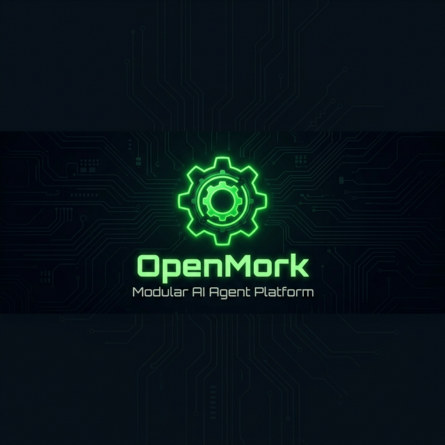

<div align="center">



<br/>
<br/>

[](LICENSE)
[](https://www.python.org/)
[](#-modular-architecture)
[](#-quick-start)

<br/>

**Like an Ork building a Warbuggy — bolt on what you need, rip out what you don't.**

<br/>

[Quick Start](#-quick-start) · [Modular Arms](#-modular-architecture) · [Controllable Safety](#️-controllable-safety) · [Modes](#-modes) · [Roadmap](#️-roadmap)

---

</div>

<br/>

## ⚙️ What is openmork?

openmork is a **modular AI agent platform** that you assemble yourself.

Every piece is swappable. Memory, gateway, security, skills, personality — all of it.
You control what goes in and what stays out.

> **You decide what your agent can and cannot do. Not the developers.**

<br/>

<div align="center">

```
                          ┌──────────────────┐
                          │  openmork-core   │
                          │   (agent loop)   │
                          └────────┬─────────┘
                                   │
            ┌──────────────────────┼──────────────────────┐
            │                      │                      │
   ┌────────▼────────┐   ┌────────▼────────┐   ┌────────▼────────┐
   │  🧠 Memory      │   │  🔧 Tools       │   │  📡 Gateway     │
   │  SQLite FTS5    │   │  bash, web,     │   │  Telegram,      │
   │  → Supabase     │   │  files + yours  │   │  Discord,       │
   │  → LanceDB      │   │                 │   │  WhatsApp...    │
   └─────────────────┘   └─────────────────┘   └─────────────────┘
            │                      │                      │
   ┌────────▼────────┐   ┌────────▼────────┐   ┌────────▼────────┐
   │  🛡️ Security    │   │  📚 Skills      │   │  🎭 Skins       │
   │  safety.yaml    │   │  auto-learning  │   │  --heretic      │
   │  YOU control    │   │  + community    │   │  --savage        │
   │  the rules      │   │  packs          │   │  --chaos         │
   └─────────────────┘   └─────────────────┘   └─────────────────┘
```

</div>

<br/>

---

## 🔩 Modular Architecture

Every component is an **"arm"** — swap it, extend it, or build your own:

<br/>

<table>
<tr>
<td width="33%">

### 🧠 Memory
**Default:** SQLite FTS5<br/>
Fast, local, zero dependencies<br/>
**Swap for:** Supabase pgvector, LanceDB, Chroma

</td>
<td width="33%">

### 📡 Gateway
**Default:** Telegram<br/>
Native multi-platform<br/>
**Also:** Discord, WhatsApp, Slack, Email, Home Assistant

</td>
<td width="33%">

### 🛡️ Security
**Default:** `safety.yaml` + Tirith<br/>
User-controlled rules<br/>
**Options:** YOLO mode, Lockdown, Custom

</td>
</tr>
<tr>
<td>

### 📚 Skills
**Default:** 100+ built-in<br/>
Auto-learning from usage<br/>
**Extend:** Community skill packs

</td>
<td>

### 🎭 Skins
**Default:** Standard<br/>
Change personality with a flag<br/>
**Custom:** `--heretic`, `--savage`, `--chaos`

</td>
<td>

### 🤖 Models
**Default:** Any provider<br/>
OpenAI, Claude, Grok, Qwen<br/>
**Also:** OpenRouter (200+), local endpoints

</td>
</tr>
</table>

<br/>

---

## 🚀 Quick Start

```bash
# Clone
git clone https://github.com/Wosmim/openmork.git
cd openmork

# Install
bash setup-openmork.sh

# Configure your safety rules
mkdir -p ~/.openmork
cp safety.yaml.default ~/.openmork/safety.yaml

# Start
openmork
```

<details>
<summary><strong>📡 Connect to Telegram</strong></summary>

```bash
openmork gateway --telegram
```
</details>

<details>
<summary><strong>🤖 Switch models</strong></summary>

```bash
openmork model set gpt-4o        # OpenAI
openmork model set claude-sonnet  # Anthropic  
openmork model set grok-3         # xAI
openmork model set deepseek-r1    # DeepSeek
```
</details>

<details>
<summary><strong>🔄 Migrate from OpenClaw</strong></summary>

```bash
openmork claw migrate             # Import settings, memories, skills
openmork claw migrate --dry-run   # Preview (nothing is modified)
```
</details>

<br/>

---

## 🛡️ Controllable Safety

openmork **never** silently blocks you. Every security decision goes through you.

```yaml
# ~/.openmork/safety.yaml — YOUR rules, YOUR control
dangerous_patterns:
  - pattern: '\brm\s+-[^\s]*r'
    description: "recursive delete"
  # Remove what you don't want
  # Add your own patterns
```

<div align="center">

| ⚡ YOLO | 🛡️ Guided | 🔒 Lockdown |
|:---:|:---:|:---:|
| `OPENMORK_YOLO_MODE=1` | `safety.yaml` active | Tirith + strict rules |
| No questions asked | **You decide** | For public-facing bots |

</div>

<br/>

---

## 🎭 Modes

```bash
openmork --heretic    # 🔥 Fully uncensored, local models only
openmork --savage     # ⚔️  Aggressive problem-solving
openmork --based      # 💬 Opinionated, no-BS responses
openmork --genius     # 🧪 Deep analytical mode
openmork --chaos      # 🌀 Experimental, creative, unpredictable
```

<br/>

---

## 🧠 Features

<div align="center">

| | Feature | Description |
|---|---|---|
| 💾 | **Self-improving memory** | SQLite FTS5 — remembers everything, searchable, local |
| 📖 | **Skills auto-learning** | Creates skills from experience, improves on use |
| 📡 | **Multi-platform** | Telegram, Discord, WhatsApp, Slack, Email — native |
| 🤖 | **Any model** | OpenAI, Claude, Grok, Qwen, OpenRouter (200+), local |
| 🎭 | **Skins** | Change personality with a single flag |
| ⏰ | **Cron** | Automated tasks on schedule |
| 🔒 | **Controllable security** | You control every safety decision |

</div>

<br/>

---

## 🗺️ Roadmap

- [x] Controllable safety (`safety.yaml` + Tirith warn-only)
- [x] Modular architecture
- [ ] Port modes as skins (`--heretic`, `--savage`, etc.)
- [ ] Semantic vector search (Ollama + pgvector)
- [ ] Community skill packs
- [ ] Plugin system for arms
- [ ] Multi-agent orchestration
- [ ] Web dashboard

---

## 🤝 Contributing

Every **arm** is an opportunity:

| | What to build |
|---|---|
| 🧠 | Memory backends — vector search, graph DBs |
| 🔧 | Tools — integrate your favorite services |
| 📡 | Gateways — new platforms, voice, IoT |
| 📚 | Skill packs — curated collections |
| 🎭 | Skins — new personalities and modes |

```bash
git checkout -b arm/my-new-feature
```

See [CONTRIBUTING.md](CONTRIBUTING.md) for details.

---

## 🙏 Acknowledgements

openmork is built on the shoulders of great open-source projects:

- [Hermes-Agent](https://github.com/NousResearch/hermes-agent) by Nous Research
- [OpenClaw](https://github.com/anthropics/claude-code)
- [Superpowers](https://github.com/obra/superpowers)
- [MetaClaw](https://github.com/aiming-lab/MetaClaw)

## 📄 License

MIT — see [LICENSE](LICENSE).

---

<div align="center">

**Build your agent. Piece by piece. No limits.**

*WAAAGH!* ⚙️

</div>
